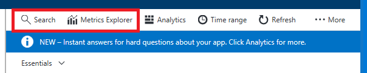
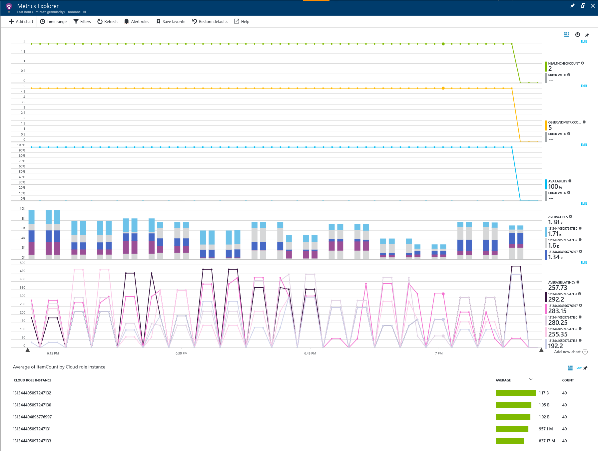
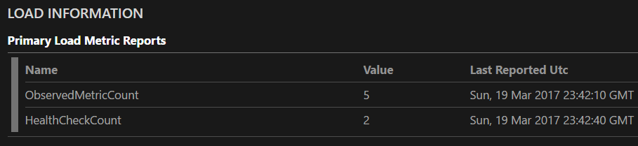

# Azure Service Fabric watchdog sample
Azure Service Fabric Watchdog service sample
Discusses the Azure Service Fabric watchdog service sample, how to use it within your cluster and with your services. This sample uses features of C# 7.0 and requires Visual Studio 2017. The sample also uses the Reverse Proxy, which must be installed on the cluster. On a one box deployment, it is installed by default using port 19081, the code assumes this port.

As mentioned in [Monitor and diagnose Azure Service Fabric applications](https://docs.microsoft.com/azure/service-fabric/service-fabric-diagnostics-overview) a watchdog can be part of the monitoring strategy of your application. With Service Fabric a watchdog is nothing more than an auxiliary service that is watching the primary service. It can observe health and load metrics reports the primary service is emitting or make calls to the primary service and ensure it is receiving correct responses. Watchdogs can watch multiple services and detect trends that are occurring across the services. Because of these tight dependencies the watchdogs must be aware of versioning across the services they are observing. Care must be taken when deploying if a v1 watchdog, won't work with a v2 service or the reverse, a v2 watchdog and v1 service.

The sample described in this article is watchdog service, not tied to a particular service implementation. It can be used with any Service Fabric services and performs the following three functions

* Monitor the health of a REST based service by periodically making requests of the the service
* Monitor the load metrics exposed by services
* Report both health and load metrics to a telemetry provider, such as Application Insights
* Clean up Service Fabric diagnostic logs, keeping only a configurable number of days logs

The sample includes a test application that shows how integration with the service can be done.

## Integration with Application Insights

Application Insights is primarily designed for web site metrics, so there isn't a curated dashboard for a Service Fabric service. This sample uses the existing Application Insights concepts and properties where possible. This sample shows integration with Application Insights, but the code is written to allow another telemetry provider if desired. To configure Application Insights, place the key in AIKey within the PackageRoot\Config\Setttings.xml file. After running the sample for a few minutes, you'll be able to configure your Application Insights dashboard using Search and Metrics explorer. 



### Search

Clicking on the search will show a view similar to


The graph shows the number of events being generated from the watchdog and the breakdown between the trace events and the availability events. Detailed information about these events is found below where you can see the detail of each trace and availability event. The trace events are showing the health report of the entire cluster. Other traces will appear if applications or nodes are not healthy. Each trace can be opened further to show even more detailed information about the event. The code generating these traces can be found in the ReportClusterHealth method of *WatchdogService.cs*.

The availability events are generated by running the health check registered by each of the services. How to register a health check is discussed in the next section. Each of the availability events show the name of the health check, in the diagram, there are two types **Watchdog Health Check** which is the health check that the watchdog service performs on itself and **UniqueHealthCheckName** which is the name the *TestStatelessService* registered for its health check. The availability event shows the outome and the duration of the health check. These fields can be used to built graphs and reports for the service availability within the [analytics portion of Application Insights](https://docs.microsoft.com/azure/application-insights/app-insights-analytics). For example, the query outputs a table containing the number of successful health checks and their average duration grouped by the health check name. See [Reference for Analytics](https://docs.microsoft.com/azure/application-insights/app-insights-analytics-reference) for more details.

```
availabilityResults
| summarize count(success=true), avg(duration) by name
```

### Metrics

Metrics Explorer enables you to create dashboards containing graphs or tables of metric content. An example of the dashbaord generated from the TestStatelessService metrics is

.

The dashboard was configured to show the

* Number of health checks registered with the watchdog service
* Number of metric checks registered wiht the watchdog service
* Availability of all of the services reporting availbility
* RPS rate for each of the five service instances along with the overall average rate
* Average latency for each of the five service instances along with the overall average latency
* Number of items contained within a service instance

This sample uses cloud role instances for instances or replicas and cloud role name for the name of a service. This allows grouping within the current Metric Explorer user experience. Once a dashboard is configured, it can be saved to allow other users access to the dashboard. For more information on Application Insights metrics explorer see [Exploring Metrics in Application Insights](https://docs.microsoft.com/azure/application-insights/app-insights-metrics-explorer).

## Monitoring the health of REST based services

Service Fabric allows for many different communication mechanisms, HTTP based mechanisms are easy to test generically because they are standard, they don't require custom proxies or other such communication mechanisms. This watchdogs service supports HTTP based testing of endpoints on a scheduled basis. If your service is using another mechanism, the health check portion watchdog service could be extended to support specific tests, but care must be taken to support the versioning of the tests and the services. For HTTP based services, the subscribing service makes a request for a health check during the RunAsync method. The **healthcheck** endpoint on the watchdog service is called with the body containing JSON such as

```json
{
  "name": "UniqueHealthCheckName",                                 // unique name of the health check. Should be human recongizable.
  "serviceName": "fabric:/TestStatelessApp/TestStatelessService",  // name of the service.
  "partition": "e8025497-5eb6-4e90-9c52-50b0221bd4b2",             // partition identifier of the service.
  "endpoint": "",                                                  // optional endpoint name if more than one endpoint is exposed. Required if more than one endpoint is exposed from the service.
  "frequency": "00:02:00",                                         // how often this will be executed in HH:MM:SS. 
  "suffixPath": "api/values",                                      // query path suffix that will be appended to the service endpoint.
  "method": {
    "Method": "GET"                                                // this is the HTTP verb used to call the service.
  },
  "content" : "myContent",                                         // optional content to send to the service in the request body.
  "mediaType": "application/json",                                 // optional media type of the content. Only required if content is specfied.
  "expectedDuration": "00:00:00.2000000",                          // optional expected duration of the request. Default is 200ms.
  "maximumDuration": "00:00:05",                                   // optional maximum duration of the request. Default is 5000ms.
  "headers" : {
    "If-Match" : "match_tag"                                       // optional dictionary of HTTP headers to add to the request.
  },
  "warningStatusCodes" : [ 408, 409 ],                             // optional list of HTTP status codes to consider as a warning.
  "errorStatusCodes" : [ 401, 412,]                                // optional list of HTTP status codes to consider as an error.
}
```

There are additional properties defined on the HealthCheck structure that this JSON is deserialized into, but they are used to track the request when it is stored in the watchdog service. Provide the JSON for the health check and class the endpoint to have the watchdog start testing and reporting on the health of your service. The code below is in the *TestStatelessService.cs* file in the TestStatelessService project and demonstrates how to make this call using Service Fabric's built in [reverse proxy](https://docs.microsoft.com/azure/service-fabric/service-fabric-reverseproxy).

```csharp
    bool result = false;
    HttpClient client = new HttpClient();
    string jsonTemplate = "{{\"name\":\"UniqueHealthCheckName\",\"serviceName\": \"{0}\",\"partition\": \"{1}\",\"frequency\": \"{2}\",\"suffixPath\": \"api/values\",\"method\": {{ \"Method\": \"GET\" }}, \"expectedDuration\": \"00:00:00.2000000\",\"maximumDuration\": \"00:00:05\" }}";
    string json = string.Format(jsonTemplate, Context.ServiceName, Context.PartitionId, TimeSpan.FromMinutes(2));

    HttpRequestMessage request = new HttpRequestMessage(HttpMethod.Post, "http://localhost:19081/Watchdog/WatchdogService/healthcheck");
    request.Content = new StringContent(json, Encoding.Default, "application/json");

    var msg = await client.SendAsync(request);
```

There are three endpoints exposed by the watchdog *HealthCheckController*, each of them calls a corresponding method with the HealthCheckOperations class, separating the business logic from the watchdog service.

* api/healthcheck/health - GET operation returning the health of the watchdog service. Used to validate the service is healthy.
* api/healthcheck/{application?}/{service?}/{partition=guid?} - GET operation returning the health check instances filtered by the provided values. All values are optional.
* api/healthcheck - POST operation accepting a JSON HealthCheck instance. The instance will be saved within the watchdog service. The values within the HealthCheck JSON will be validated before being accepted. Each time the data is sent, it will be inserted or updated. It is fine to send multiple time or from multiple service instances.

## Monitoring metrics exposed by services

Service instances can also register metrics for the watchdog to monitor and publish to Application Insights. There are two endpoints exposed by the *MetricsController*

* api/metrics/{application?}/{service?}/{partition:guid?} - GET operation returning the metrics values being monitoried filtered by the provided values. All values are optional.
* api/metrics/{application}/{service?}/{partition:?} - POST operation accepting an array of string values that are the names of the metrics to monitor for the provided application, service and partition. Service and partition are optional values. As with the health check endpoint, the data can be sent multiple times and will be inserted or updated. The application value is required.

For each of the permutations below, only the metrics that match one of the names in the metric list will be monitored. If there is a RPS, Count and Latency metric published, the body of the POST must contain [ 'RPS', 'Latency' ] if those two metrics are to be monitored. Count will not be monitored.

If the applicaiton, service and partition are provided, the metric values will be read from the partition. If the service and partition are not provided then the metrics of the application will be monitored. If the service is provided, then each partition within the service will be queried for its replica or instances and each replica or instance will be monitored for the specified metric. This is the easy way to monitor all instances within a singleton stateless service. For details on how this works, look at the code within *MetricOperations.cs*.

As with the health checks, the metrics POST method is called during service startup, registering the metrics to be monitored. It may be called more than once to monitor at the application, service or parition level as desired. The code below is in the *TestStatelessService.cs* file and demonstrates how to make this call.

```csharp
    string uri = $"http://localhost:19081/Watchdog/WatchdogService/metrics/TestStatelessApp/TestStatelessService";

    // Now register them with the watchdog service.
    HttpClient httpClient = new HttpClient();
    HttpRequestMessage request = new HttpRequestMessage(HttpMethod.Post, uri);
    request.Content = new StringContent("[\"RPS\", \"Failures\", \"Latency\", \"ItemCount\"]", Encoding.Default, "application/json");

    var msg = await httpClient.SendAsync(request);
```

## Clean up Service Fabric diagnostic logs

The default configuration for a Service Fabric cluster has [diagnostics enabled](https://docs.microsoft.com/azure/service-fabric/service-fabric-diagnostics-how-to-setup-wad.md). This sends a large volume of events from the cluster to the storage account within the cluster's resource group, but unlike the Service Fabric support logs, these events are not groomed and will continue to grow in size. The watchdog service has the ability to groom the events from these log tables, maintaining a configurable number of days events in case they are needed for troubleshooting. Older events are deleted from the table. The three tables within the storage account are **WADPerformanceCountersTable**, **WADServiceFabricSystemEventTable**, **WADServiceFabricReliableServiceEventTable**. There is a fourth table for services that are using Actors, the watchdog would have to be extended to clean the **WADServiceFabricReliableActorEventTable**. To enable this clean up, provide valid values for the following settings within the watchdog services Settings.xml file.

* DiagnosticEndpoint - URL to the storage account. The storage account does not have a standard name, but it will contain these tables if diagnostics has been enabled.
* DiagnosticsSasToken - SAS token value from the storage account **Shared access signature** pane within the Azure Portal. Generate a SAS token that has permissions for the table service, all resource types, to read, delete and list tables for a specific time interval. This SAS Token value must be updated before it expires or clean up will not occur.
* DiagnosticInterval - Time interval for how often to run specified as HH:MM:SS. This value along with the count can be used to throttle the clean up service if it is using too many resources.
* DiagnosticTargetCount - Number of items targeted to be deleted during a single run. If there are more than this number of items to be removed, a small number more than this may be removed because of batching.
* DiagnosticTimeToKeep - Time interval for how long to keep events within the tables specified as DD:HH:MM:SS. Any events older than this interval will be removed.

## Monitoring the watchdog service

The watchdog has code to watch and report on its own health and metrics. Each of the operations classes is monitored along with the watchdof service and reported to Service Fabric as health events. During startup of the watchdog service, the health events will be reported as in error until the service starts to run. An example of the health events is shown below


There are also two metrics that the watchdog exposes

* ObservedMetricCount - Number of unique metric requests registered to observe a set of metrics
* HealthCheckCount - Number of unique health check requests registered



The watchdog service is instrumented using an EventSource named "Microsoft-ServiceFabric-WatchdogService". This EventSource can be added to your monitoring events. See the monitoring overview document for how to monitor an EventSource.

## Adding a different telemetry provider

While the sample uses Application Insights as its telemetry provider, other telemetry providers can be used. To do this, create a class that implements the *IWatchdogTelemetry* interface and replace the creation of the AITelemetry class with your custom implementation. 

Within *WatchdogService.cs* RunAsync. The call to GetConfigValueAsString returns the value of the AIKey setting.

```csharp
    _telemetry = new AiTelemetry(GetConfigValueAsString(WatchdogConfigSectionName, "AIKey"));
```

Use the code in *AITelemetry.cs* as a guide for how to implment the interface correctly.

## Contributing

This project has adopted the [Microsoft Open Source Code of Conduct](https://opensource.microsoft.com/codeofconduct/). For more information see the [Code of Conduct FAQ](https://opensource.microsoft.com/codeofconduct/faq/) or contact [opencode@microsoft.com](mailto:opencode@microsoft.com) with any additional questions or comments.
